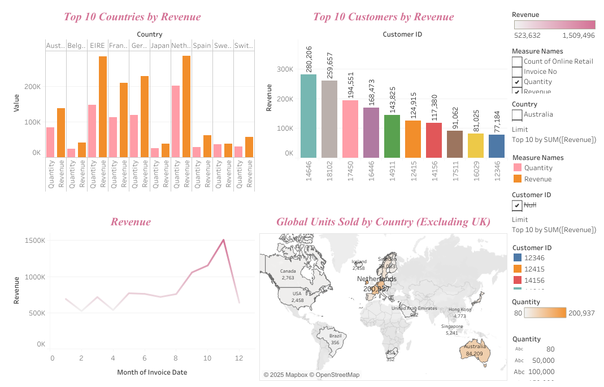

# Customer Revenue & Sales Insights Dashboard

📊 **Tableau Project analysing customer revenue, quantity sold, and global distribution.**

## Project Overview
This dashboard provides insights into:
- Top 10 Customers by Revenue (excluding null Customer IDs)
- Revenue & Quantity by Region
- Global Sales Map (excluding United Kingdom)

## Key Features
- Interactive filters for top 10 countries and customers
- Side-by-side bar charts comparing Revenue vs. Quantity
- Map visualization for global sales distribution
- Clean and professional dashboard design

## Skills Demonstrated
- Data Cleaning & Transformation (Excel / Power Query)
- Data Visualization (Tableau)
- Dashboard Design for Business Insights
- Customer Segmentation & Revenue Analysis

## Preview

## Live Dashboard
🔗 https://public.tableau.com/your-dashboard-link](https://public.tableau.com/app/profile/fundiswa.ngomani/viz/OnlineRetailDataSet_17590138957550/Dashboard1
